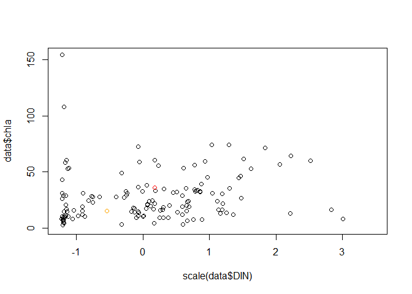

Model diagnostics
================
Helen Miller
2025-04-04

``` r
library(data.table)
library(ggplot2)
library(patchwork)
library(kableExtra)
library(lme4)
```

    ## Loading required package: Matrix

``` r
source(here::here("03_figures/themes.R"))

data_dir <- "00_data"
data <- fread(here::here(data_dir, "combined-data.csv"))
data[region == "", region := NA]
data <- data[env == "pelagic" & depth == "surface"]

data[, dataset := factor(dataset, levels = c("burnett", 
                                             "holtgrieve", 
                                             "miller", 
                                             "heu", 
                                             "loken", 
                                             "yoshikawa"))]
data[, region := factor(region, levels = c("North",
                                           "Central",
                                           "South"))]
data[, season := factor(season, levels = c("low", 
                                           "rising", 
                                           "high", 
                                           "falling"))]
```

``` r
ctl <- glm.control(epsilon = 1e-4)
glmer_ctl <- glmerControl(optimizer = "bobyqa", tol = 1e-4, optCtrl=list(maxfun=100000))
delta <- 0.0001 # delta to add for 0s in response
```

# Best models

Test with and without N/P interaction

``` r
model_dissolved <- 
  glm(chla ~ 
          scale(DIN) + 
          scale(DIP) + 
          season:(scale(DIP)) +
          season +
          dataset, 
        family = Gamma(link = "log"), 
        data = data)
model_total <- 
  glm(chla ~ 
          scale(TN) + 
          scale(TP) + 
          season:(scale(TP)) +
          season +
          region , 
        family = Gamma(link = "log"), 
        data = data)
```

## Residuals

``` r
ggplot() +
  geom_point(aes(x =fitted(model_dissolved, type = "response"), y = resid(model_dissolved), 
                 color = model_dissolved$model$season)) +
  scale_color_discrete("Season", type = season_colors) +
  tsl_theme
```

<!-- -->

``` r
ggplot() +
  geom_point(aes(x =fitted(model_total, type = "response"), y = resid(model_total), 
                 color = model_total$model$season)) +
  scale_color_discrete("Season", type = season_colors) +
  tsl_theme
```

<!-- -->

``` r
library(DHARMa)
```

    ## Warning: package 'DHARMa' was built under R version 4.4.1

    ## This is DHARMa 0.4.6. For overview type '?DHARMa'. For recent changes, type news(package = 'DHARMa')

``` r
dharma_sim_dissolved <- simulateResiduals(fittedModel = model_dissolved)
plotQQunif(dharma_sim_dissolved)
```

<!-- -->

``` r
plotResiduals(dharma_sim_dissolved)
```

<!-- -->

``` r
dharma_sim_total <- simulateResiduals(fittedModel = model_total)
plotQQunif(dharma_sim_total)
```

<!-- -->

``` r
plotResiduals(dharma_sim_total)
```

<!-- -->

## GOF

``` r
# hidden heterogeneity
# Goodness of fit test specifically for gamma
# tests to see if you have the variance you would expect for fitted values
# Download https://drive.google.com/file/d/13CiZICgQ8uFEKbawcvuf4wLxAeH69dg8/view 
# then install with install.packages("/path/to/file")
Ght::gamma.scoretest.hidden.glm(model_dissolved)
```

    ## 
    ##      Score test for dispersion heterogeneity
    ## 
    ## stat = 1.100962, p-value = 0.1354567
    ## alternative hypothesis: dispersion is heterogeneous. 
    ## MLE for dispersion =  0.31182

``` r
Ght::gamma.scoretest.hidden.glm(model_total)
```

    ## 
    ##      Score test for dispersion heterogeneity
    ## 
    ## stat = -0.1382225, p-value = 0.5549677
    ## alternative hypothesis: dispersion is heterogeneous. 
    ## MLE for dispersion =  0.2080119

## Influence and leverage points

``` r
# Influence
mm <- model.matrix(model_dissolved)
faraway::halfnorm(hv <- hatvalues(model_dissolved))
```

<!-- -->

``` r
# Leverage
cooks <- cooks.distance(model_dissolved)
faraway::halfnorm(cooks, labs = names(cooks), nlab = 3)
```

<!-- -->

``` r
data[as.numeric(names(cooks)), cooks_distance := cooks]

# 105 have high influence. 
# 178, 191, 15 have high leverage. 
d <- model_dissolved$model
plot(scale(data$DIN), data$chla)
points(d[c(15),]$`scale(DIN)`, d[c(15),]$chla, col = "red") # high hat values (influence)
points(d[c(105),]$`scale(DIN)`, d[c(105),]$chla, col = "orange") # high cook's (leverage)
```

<!-- -->

``` r
plot(scale(data$DIP), data$chla)
points(d[c(15),]$`scale(DIP)`, d[c(15),]$chla, col = "red") # high hat values (influence)
points(d[c(105),]$`scale(DIP)`, d[c(105),]$chla, col = "orange") # high cook's (leverage)
```

<!-- -->

## Season models (ANOVA)

``` r
data <- fread(here::here(data_dir, "combined-data.csv"))
data[region == "", region := NA]
# set levels to control intercept

data[, dataset := factor(dataset, levels = c("burnett", 
                                             "holtgrieve", 
                                             "miller", 
                                             "heu", 
                                             "loken", 
                                             "yoshikawa"))]
data[, region := factor(region, levels = c("North",
                                           "Central",
                                           "South"))]
data[, season := factor(season, levels = c("low", 
                                           "rising", 
                                           "high", 
                                           "falling"))]
data <- data[env == "pelagic" & depth == "surface"]

ctl <- glm.control(epsilon = 1e-4)
delta <- 0.0001 # delta to add for 0s in response
Y <- c("DIP", 
       "DIN", 
       "TP", 
       "TN", 
       "NO3", 
       "DSi", 
       "DIN.DIP", 
       "TN.TP", 
       "chla", 
       "DO", 
       "cond")
```

``` r
test_gof <- function(y) {
  formula <- formula(paste(y, "+delta ~ season + dataset + region"))
  model <- glm(formula,  
               family = Gamma(link="log"), 
               data= data, 
               na.action = na.omit)
  dharma_sim <- simulateResiduals(fittedModel = model)
  plotQQunif(dharma_sim, main = y)
  plotResiduals(dharma_sim, main = y)
  
  return(Ght::gamma.scoretest.hidden.glm(model))
}

for (y in Y) {
  print(y)
  print(test_gof(y))
}
```

    ## [1] "DIP"

<!-- --><!-- -->

    ## 
    ##      Score test for dispersion heterogeneity
    ## 
    ## stat = -1.898557, p-value = 0.9711886
    ## alternative hypothesis: dispersion is heterogeneous. 
    ## MLE for dispersion =  0.4602691 
    ## 
    ## [1] "DIN"

<!-- --><!-- -->

    ## 
    ##      Score test for dispersion heterogeneity
    ## 
    ## stat = 0.466683, p-value = 0.3203633
    ## alternative hypothesis: dispersion is heterogeneous. 
    ## MLE for dispersion =  0.2912159 
    ## 
    ## [1] "TP"

<!-- --><!-- -->

    ## 
    ##      Score test for dispersion heterogeneity
    ## 
    ## stat = -6.595162, p-value = 1
    ## alternative hypothesis: dispersion is heterogeneous. 
    ## MLE for dispersion =  0.3846491 
    ## 
    ## [1] "TN"

<!-- --><!-- -->

    ## 
    ##      Score test for dispersion heterogeneity
    ## 
    ## stat = -0.1511245, p-value = 0.5600613
    ## alternative hypothesis: dispersion is heterogeneous. 
    ## MLE for dispersion =  0.1307985 
    ## 
    ## [1] "NO3"

<!-- --><!-- -->

    ## 
    ##      Score test for dispersion heterogeneity
    ## 
    ## stat = -1.428323, p-value = 0.9234006
    ## alternative hypothesis: dispersion is heterogeneous. 
    ## MLE for dispersion =  0.896952 
    ## 
    ## [1] "DSi"

<!-- --><!-- -->

    ## 
    ##      Score test for dispersion heterogeneity
    ## 
    ## stat = -5.75579, p-value = 1
    ## alternative hypothesis: dispersion is heterogeneous. 
    ## MLE for dispersion =  0.3711418 
    ## 
    ## [1] "DIN.DIP"

<!-- --><!-- -->

    ## 
    ##      Score test for dispersion heterogeneity
    ## 
    ## stat = 1.767886, p-value = 0.03853996
    ## alternative hypothesis: dispersion is heterogeneous. 
    ## MLE for dispersion =  0.443455 
    ## 
    ## [1] "TN.TP"

<!-- --><!-- -->

    ## 
    ##      Score test for dispersion heterogeneity
    ## 
    ## stat = -1.315022, p-value = 0.9057487
    ## alternative hypothesis: dispersion is heterogeneous. 
    ## MLE for dispersion =  0.1921556 
    ## 
    ## [1] "chla"

<!-- --><!-- -->

    ## 
    ##      Score test for dispersion heterogeneity
    ## 
    ## stat = 1.226622, p-value = 0.1099824
    ## alternative hypothesis: dispersion is heterogeneous. 
    ## MLE for dispersion =  0.2920886 
    ## 
    ## [1] "DO"

<!-- -->

    ## qu = 0.75, log(sigma) = -3.081093 : outer Newton did not converge fully.

<!-- -->

    ## 
    ##      Score test for dispersion heterogeneity
    ## 
    ## stat = -8.61051, p-value = 1
    ## alternative hypothesis: dispersion is heterogeneous. 
    ## MLE for dispersion =  0.0949413 
    ## 
    ## [1] "cond"

<!-- --><!-- -->

    ## 
    ##      Score test for dispersion heterogeneity
    ## 
    ## stat = -0.1923322, p-value = 0.576259
    ## alternative hypothesis: dispersion is heterogeneous. 
    ## MLE for dispersion =  0.02780835
